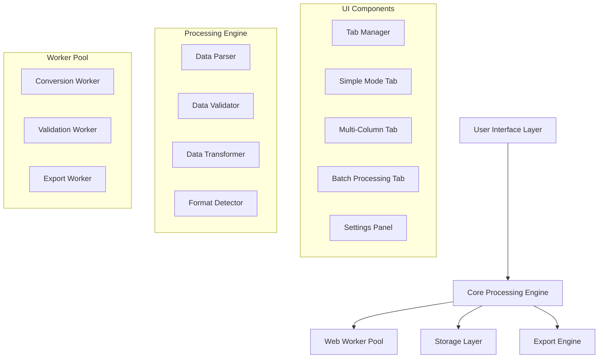

# Design Document

## Overview

Version 3 of the String to CSV Converter will transform the extension from a simple single-purpose tool into a comprehensive data processing platform. The design maintains the current extension's core strengths—simplicity, performance, and user experience—while adding powerful new capabilities through a modular, tab-based architecture.

The extension will feature a redesigned interface with multiple processing modes, enhanced performance through improved web worker architecture, and extensible data processing capabilities that can handle various input formats and complex transformations.

## Architecture

### High-Level Architecture



### Component Architecture

The extension follows a modular component-based architecture with clear separation of concerns:

1. **UI Layer**: Tab-based interface with reactive components
2. **Core Engine**: Central processing logic with pluggable modules
3. **Worker Pool**: Background processing for performance-critical operations
4. **Storage Layer**: Persistent settings and template management
5. **Export Engine**: Multi-format output generation

## Components and Interfaces

### 1. Tab Manager System

**Purpose**: Manages the multi-tab interface and coordinates between different processing modes.

**Key Components**:

- `TabManager`: Central controller for tab switching and state management
- `TabComponent`: Base class for all tab implementations
- `TabRegistry`: Dynamic tab registration system

**Interface**:

```javascript
class TabManager {
  registerTab(tabId, tabComponent)
  switchTab(tabId)
  getCurrentTab()
  broadcastEvent(event, data)
}

class TabComponent {
  initialize()
  activate()
  deactivate()
  handleEvent(event, data)
  getState()
  setState(state)
}
```

### 2. Simple Mode Tab (Enhanced)

**Purpose**: Improved version of the current single-string conversion functionality.

**Enhancements**:

- Smart separator detection
- Real-time format preview
- Enhanced validation feedback
- Template support

**Key Features**:

- Maintains current UI familiarity
- Adds preview pane for large datasets
- Integrates with new validation system

### 3. Multi-Column Processing Tab

**Purpose**: Handles tabular data with configurable row and column separators.

**Key Components**:

- `MultiColumnParser`: Parses tabular input data
- `SeparatorDetector`: Automatically detects row/column separators
- `GridPreview`: Visual preview of parsed data
- `HeaderManager`: Handles header row detection and preservation

**Interface**:

```javascript
class MultiColumnProcessor {
  parseTabularData(input, rowSeparator, columnSeparator)
  detectSeparators(input)
  generatePreview(parsedData)
  validateStructure(parsedData)
  convertToCSV(parsedData, options)
}
```

**UI Components**:

- Input textarea for tabular data
- Separator configuration panel
- Live preview grid (max 10 rows visible)
- Column mapping and header options

### 4. Batch Processing System

**Purpose**: Handles multiple inputs and file-based processing.

**Key Components**:

- `BatchProcessor`: Manages multiple conversion jobs
- `FileHandler`: Handles file uploads and URL imports
- `QueueManager`: Manages processing queue and progress
- `FormatDetector`: Automatically detects input formats

**Supported Input Sources**:

- Multiple text inputs
- File uploads (TXT, CSV, JSON)
- URL imports
- Clipboard batch paste

### 5. Enhanced Data Processing Engine

**Core Processing Pipeline**:


**Key Components**:

#### Format Detector

- Analyzes input structure and content
- Suggests optimal processing settings
- Supports multiple input formats (CSV, TSV, JSON, plain text)

#### Data Parser

- Configurable parsing rules
- Support for complex separators and escape characters
- Handles malformed data gracefully

#### Data Validator

- Configurable validation rules
- Data type detection and validation
- Duplicate detection
- Format consistency checks
- PII detection and warnings

#### Data Transformer

- Custom transformation rules
- Date/time format conversion
- Number format standardization
- Text cleaning and normalization

### 6. Export Engine

**Purpose**: Generates output in multiple formats with customizable options.

**Supported Formats**:

- CSV (with various dialects)
- TSV (Tab-separated values)
- JSON (array of objects or arrays)
- Excel-compatible CSV

**Key Features**:

- Format-specific options (encoding, line endings, etc.)
- Streaming export for large datasets
- Progress tracking for large exports
- Template-based export configurations

### 7. Template System

**Purpose**: Saves and manages conversion configurations for reuse.

**Components**:

- `TemplateManager`: CRUD operations for templates
- `TemplateSerializer`: Converts settings to/from JSON
- `TemplateImporter`: Imports shared templates

**Template Structure**:

```javascript
{
  id: "unique-id",
  name: "Template Name",
  description: "Optional description",
  version: "3.0",
  settings: {
    mode: "simple|multi-column|batch",
    separators: { row: "\n", column: "\t" },
    quoting: { type: "double", escapeMethod: "double" },
    validation: { enabled: true, rules: [...] },
    export: { format: "csv", options: {...} }
  },
  created: "2025-01-01T00:00:00Z",
  modified: "2025-01-01T00:00:00Z"
}
```

### 8. Performance and Worker System

**Enhanced Web Worker Architecture**:

#### Worker Pool Manager

- Manages multiple worker instances
- Load balancing for concurrent operations
- Worker lifecycle management

#### Specialized Workers

- `ConversionWorker`: Handles data conversion operations
- `ValidationWorker`: Performs data validation in background
- `ExportWorker`: Generates export files
- `ImportWorker`: Processes file imports

**Performance Optimizations**:

- Streaming processing for large datasets (>1MB)
- Progressive rendering for UI updates
- Memory pooling to prevent leaks
- Debounced input processing
- Virtual scrolling for large previews

## Data Models

### Core Data Structures

#### ProcessingJob

```javascript
{
  id: "job-uuid",
  type: "simple|multi-column|batch",
  status: "pending|processing|completed|error",
  input: {
    data: "raw input data",
    source: "text|file|url",
    metadata: { size: 1024, encoding: "utf-8" }
  },
  settings: {
    separators: { row: "\n", column: "," },
    quoting: { type: "double", escape: "double" },
    validation: { enabled: true, rules: [] },
    transformation: { rules: [] }
  },
  output: {
    data: "processed output",
    format: "csv|tsv|json",
    metadata: { rows: 100, columns: 5 }
  },
  progress: { current: 50, total: 100 },
  errors: [],
  warnings: [],
  created: "timestamp",
  completed: "timestamp"
}
```

#### ValidationResult

```javascript
{
  isValid: true,
  errors: [
    {
      type: "format|data|structure",
      severity: "error|warning|info",
      message: "Description",
      location: { row: 5, column: 2 },
      suggestion: "Recommended fix"
    }
  ],
  statistics: {
    totalRows: 100,
    totalColumns: 5,
    emptyValues: 3,
    duplicateRows: 1,
    dataTypes: { string: 80, number: 15, date: 5 }
  }
}
```

### Storage Schema

#### Settings Storage

```javascript
{
  version: "3.0",
  ui: {
    theme: "classic|material",
    darkMode: false,
    compactMode: false,
    windowSize: { width: 400, height: 600 },
    activeTab: "simple",
    collapsedSections: []
  },
  defaults: {
    simple: { separator: "newline", quoting: "double", trim: true },
    multiColumn: { rowSep: "\n", colSep: "\t", headers: true },
    batch: { autoDetect: true, validation: true }
  },
  templates: [
    // Array of saved templates
  ],
  performance: {
    workerCount: 2,
    streamingThreshold: 1048576, // 1MB
    previewLimit: 1000
  }
}
```

## Error Handling

### Error Categories

1. **Input Errors**: Invalid format, encoding issues, size limits
2. **Processing Errors**: Parsing failures, transformation errors
3. **Validation Errors**: Data quality issues, format violations
4. **Export Errors**: File generation failures, format incompatibilities
5. **System Errors**: Worker failures, memory issues, storage problems

### Error Handling Strategy

#### Graceful Degradation

- Continue processing valid data when encountering errors
- Provide partial results with error annotations
- Offer recovery suggestions and alternative approaches

#### User Feedback

- Clear, actionable error messages
- Visual indicators for error locations
- Suggested fixes and alternatives
- Progress preservation during errors

#### Error Recovery

- Automatic retry for transient errors
- Fallback processing methods
- Data preservation during failures
- Session recovery after crashes

## Testing Strategy

### Unit Testing

- Component isolation testing
- Data processing algorithm validation
- Error handling verification
- Performance benchmarking

### Integration Testing

- Tab switching and state management
- Worker communication and coordination
- Storage operations and data persistence
- Export format validation

### Performance Testing

- Large dataset processing (up to 15MB)
- Memory usage monitoring
- Worker pool efficiency
- UI responsiveness under load

### User Experience Testing

- Accessibility compliance (WCAG 2.1 AA)
- Keyboard navigation
- Screen reader compatibility
- Cross-browser compatibility

### Test Data Sets

- Small datasets (< 1KB): Basic functionality
- Medium datasets (1KB - 1MB): Performance validation
- Large datasets (1MB - 15MB): Stress testing
- Malformed data: Error handling validation
- Edge cases: Boundary condition testing

## Migration Strategy

### Backward Compatibility

- Preserve existing user settings and preferences
- Maintain current keyboard shortcuts and UI patterns
- Support legacy template formats with automatic migration

### Data Migration

- Automatic migration of v2.5 settings to v3.0 schema
- Preservation of user customizations and themes
- Graceful handling of corrupted or incomplete settings

### Feature Rollout

- Progressive enhancement approach
- Feature flags for gradual rollout
- Fallback to v2.5 functionality if needed
- User education and onboarding for new features

This design provides a solid foundation for implementing the enhanced Chrome extension while maintaining the simplicity and performance that users expect from the current version.
